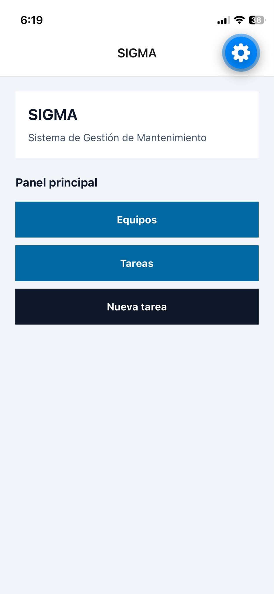
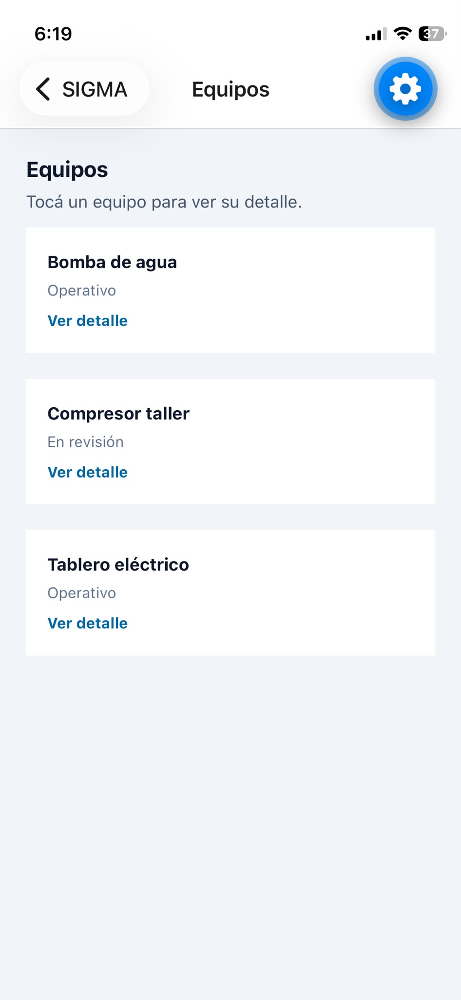
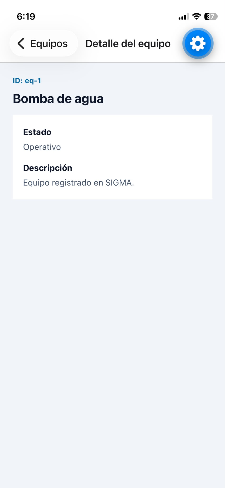
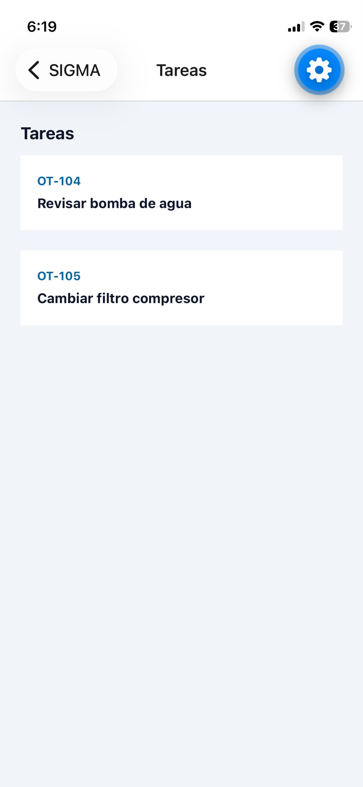
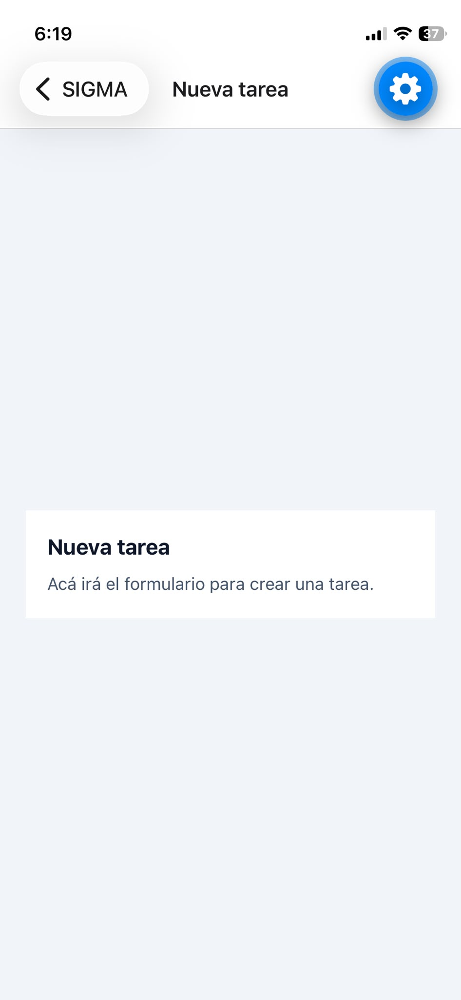

# SIGMA - Navegación

App simple de navegación para la actividad de entrega (Clase 5, DDM).
Sistema de Gestión de Mantenimiento: menú de inicio, listado de equipos
con detalle por ruta dinámica, tareas y nueva tarea.

## Tecnologías

- Expo SDK 57 + React Native 0.86 + React 19
- Expo Router (navegación por archivos, Stack)
- NativeWind 5 RC (estilos mínimos con `className`, sin `StyleSheet`)

## Cómo ejecutarlo

Requisitos: Node.js LTS y la app **Expo Go** en el celular
(actualizada, con la misma cuenta en la PC y en el celu).

```bash
cd sigma-navegacion
npm install
npx expo start --clear
```

Escaneá el QR con Expo Go. Si se queda en "Opening project"
(el celu y la PC no se ven en la red local), usá modo túnel:

```bash
npx expo start --tunnel
```

La primera carga tarda 2-3 minutos (NativeWind compila las clases).

## Rutas

| Archivo                  | Ruta                                    | Pantalla                                   |
| ------------------------ | --------------------------------------- | ------------------------------------------ |
| `app/_layout.tsx`      | (marco)                                 | Stack y títulos                           |
| `app/index.tsx`        | `/`                                   | Inicio: menú Equipos, Tareas, Nueva tarea |
| `app/equipos.tsx`      | `/equipos`                            | Lista de equipos                           |
| `app/equipos/[id].tsx` | `/equipos/eq-1`, `/equipos/eq-2`... | Detalle del equipo                         |
| `app/tareas.tsx`       | `/tareas`                             | Lista de tareas                            |
| `app/nueva-tarea.tsx`  | `/nueva-tarea`                        | Pantalla simple                            |

Flujo: Inicio → Equipos → Detalle (vuelve con ←). Cada botón usa
`Link + asChild + Pressable`. El detalle lee el `id` de la URL con
`useLocalSearchParams`.

## Capturas

| Inicio                                 | Equipos                                  | Detalle                                      |
| -------------------------------------- | ---------------------------------------- | -------------------------------------------- |
|  |  |  |

| Tareas                                 | Nueva tarea                                      |
| -------------------------------------- | ------------------------------------------------ |
|  |  |

## Casos de prueba

1. Los 3 botones de Inicio abren su pantalla.
2. Tocar cada equipo abre su detalle con el ID correcto.
3. Entrar a un id inexistente (ej: `/equipos/xxx`) muestra "no encontrado".
4. El botón ← del encabezado vuelve a la pantalla anterior.
